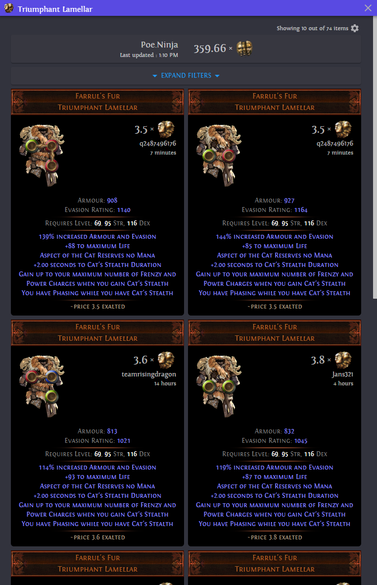
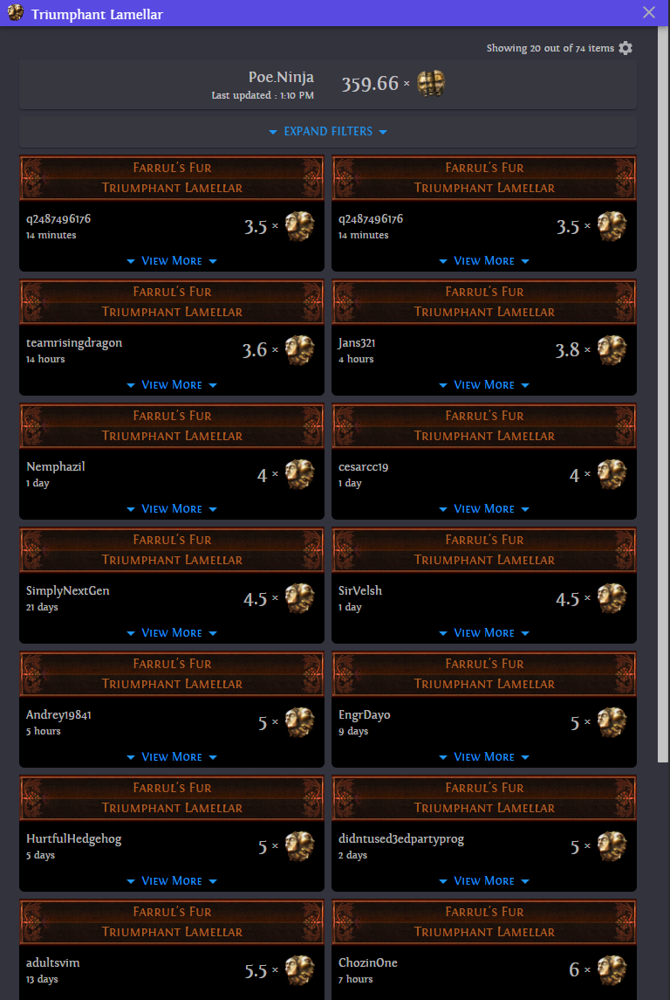
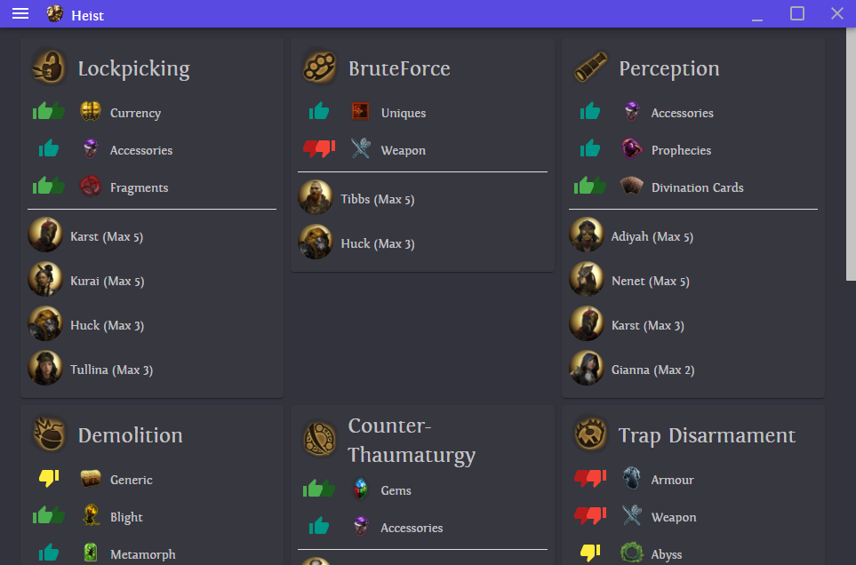
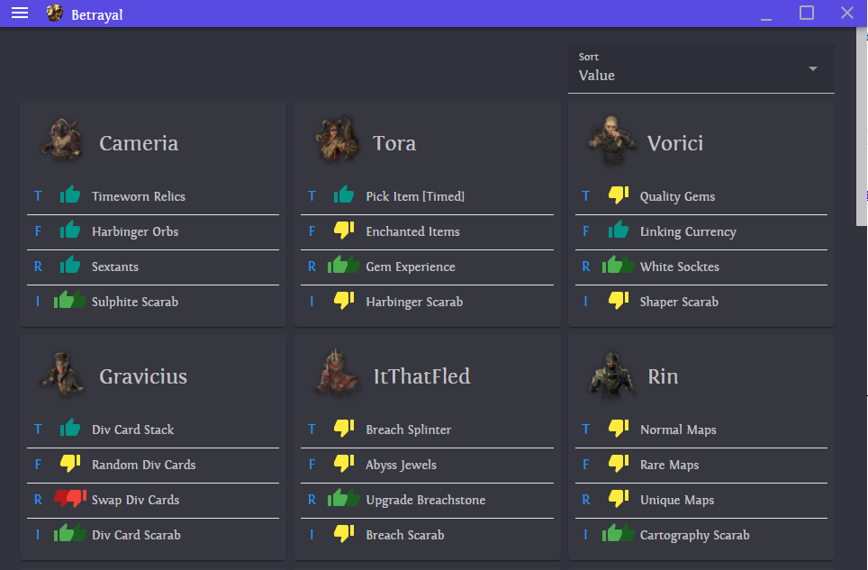
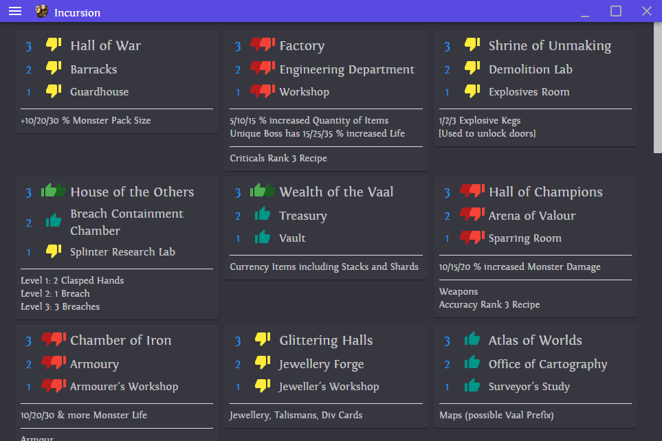
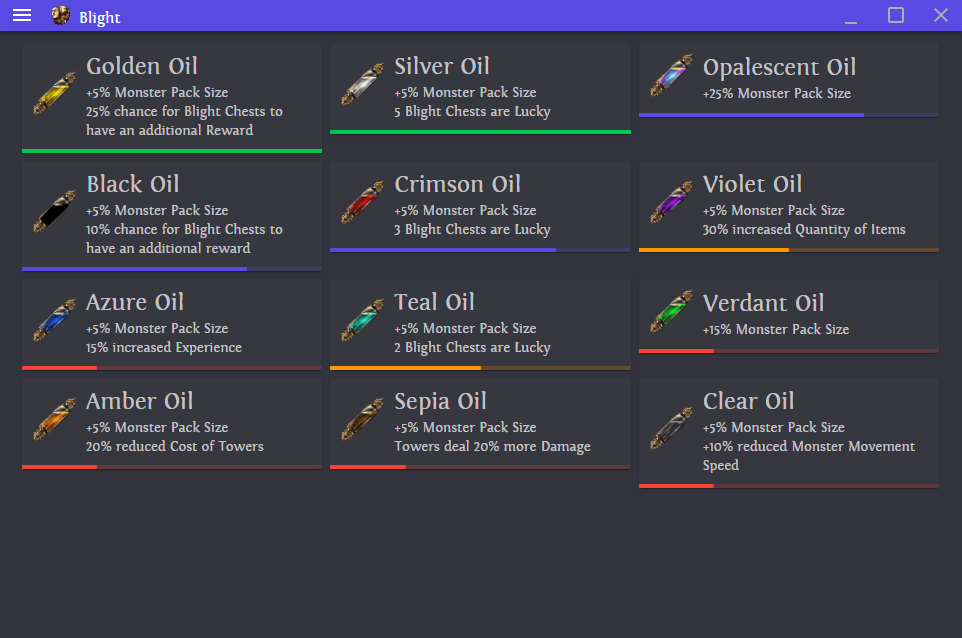
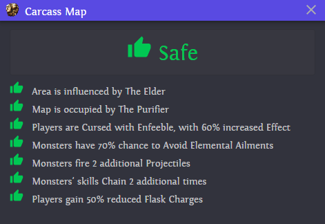

#  Sidekick 2 Beta  
A Path of Exile companion tool.

## Installation and Usage
1. [Download Sidekick](https://github.com/domialex/Sidekick/releases)
2. Extract the zip file
3. Run Sidekick.exe
4. Optionnally, you may get a security warning when running this software. You may have to add a security exception to run this software. Our code is open source and there is no malware included with this program.
5. You cannot run Path of Exile in Fullscreen mode to use this tool. We recommend using "Windowed Fullscreen".
6. Enjoy! Report issues or suggestions in our Discord or create an issue here.

## Features
### Trade
#### Default Binding: Ctrl + D
Opens a trade view from the official Path of Exile trade API. You can compare and preview items by clicking on any result. For rare items, a price prediction from poeprices.info is shown. For unique items, prices from poe.ninja are used.
| Trade | Minimized |
|---|---|
|  |  |

### Cheatsheets
#### Default Binding: F6
Opens a view with useful common information about different mechanics of the game.

| Heist | Betrayal | Incursion | Blight |
|---|---|---|---|
|  |  |  |  |

### Map Information
#### Default Binding: Ctrl + X
Checks the modifiers on a map or contract for mods that are dangerous (configurable).

| Safe Map | Unsafe Map |
|---|---|
|  |  |

### Chat Commands
| Name | Default Binding | Description |
|---|---|---|
| Go to Hideout | F5 | Quickly go to your hideout. Writes the following chat command: `/hideout` |
| Leave Party | F4 | Quickly leave a party. You must have set your character name in the settings first. Writes the following chat command: `/kick {settings.Character_Name}` |
| Reply to Latest Whisper | Ctrl + Shift + R | Reply to the last whisper received. Starts writing the following chat command: `@{characterName}` |
| Exit to Character Selection | F12 | Exit to the character selection screen. Writes the following chat command: `/exit` |

### Other Features
| Name | Default Binding | Description |
|---|---|---|
| Open Wiki | Alt + W | Open the wiki for the item currently under your mouse. |
| Find Items | Ctrl + F | Search an item in your stash or passive tree. |
| Open Search | Alt + Q | Open the official trade website using the item under your mouse. |

## Development 
We accept most PR and ideas. If you want a feature included, create an issue and we will discuss it.

We are also available on [Discord](https://discord.gg/H4bg4GQ).

## Thanks
Community
- [Contributors](https://github.com/domialex/Sidekick/graphs/contributors)
- [Path of Exile Trade](https://www.pathofexile.com/trade)
- [poe.ninja](https://poe.ninja/)
- [poeprices.info](https://www.poeprices.info/)
- [POE-TradeMacro](https://github.com/PoE-TradeMacro/POE-TradeMacro) - Original idea

Technology
- [MudBlazor](https://mudblazor.com/)
- [FluentAssertions](https://fluentassertions.com)
- [Electron](https://www.electronjs.org/)
- [Electron.NET](https://github.com/ElectronNET/Electron.NET/)
- [NeatInput](https://github.com/LegendaryB/NeatInput)
- [GregsStack.InputSimulatorStandard](https://github.com/GregsStack/InputSimulatorStandard)
- [TextCopy](https://github.com/CopyText/TextCopy)
